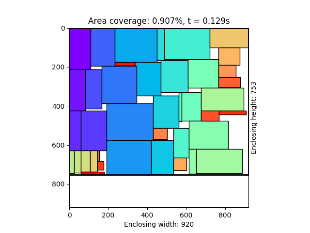
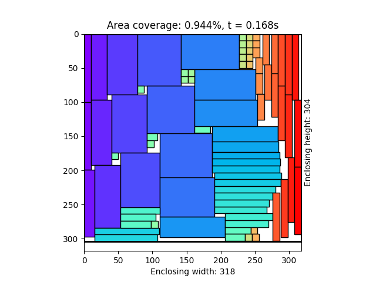

# rectangle-packer
Rectangle packing program.

Given a set of rectangles with fixed orientations, we want to
find an enclosing rectangle of minimum area that contains
them all with no overlap.

This project is inspired by the blog post [Fast Optimizing Rectangle Packing Algorithm for Building CSS Sprites](http://www.codeproject.com/Articles/210979/Fast-optimizing-rectangle-packing-algorithm-for-bu) written by Matt Perdeck.



## Installation

Download the package or clone the repository, then install with:

```bash
python setup.py install
```

or use pypi:

```bash
pip install rectangle-packer
```

## Basic Usage

```python
import rpack  # This is the module name

# Create a bunch of rectangles (width, height)
recs = [(58, 206), (231, 176), (35, 113), (46, 109), (68, 65), (90, 63)]

# Run the algorithm
positions = rpack.pack(recs)

# The result will be a list of (x, y) positions:
>>> positions
[(0, 0), (58, 0), (289, 0), (289, 113), (58, 176), (126, 176)]
```
The output positions is the top left corner coordinates of each
rectangle in the input (if we assume origin is in the top left corner).

These positions will yield a packing with no overlaps and enclosing
area as small as possible.

*For best result, sort the rectangles by height, highest first,
before running* ``rpack.pack``. The algorithm is probably far from
the best available. But in most cases it gives quite good results.

Note that you can only provide positive integers as rectangle width
and height.

## Example



