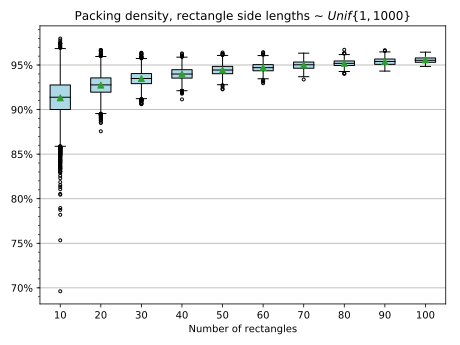
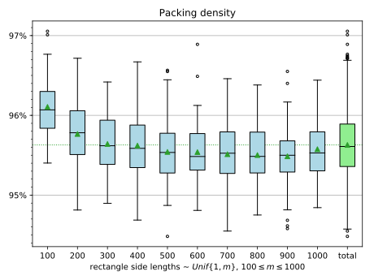
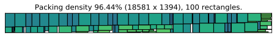
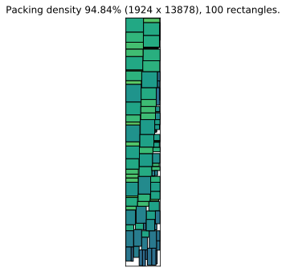
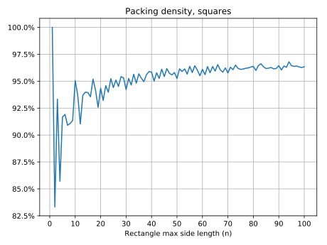
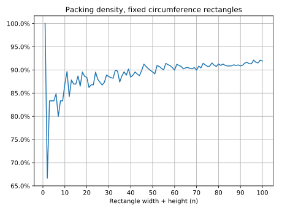
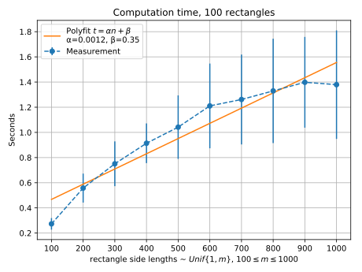
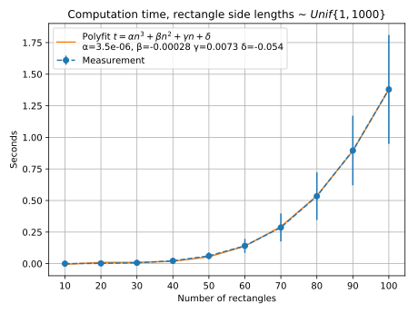
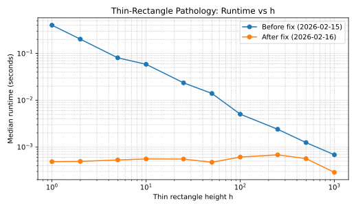
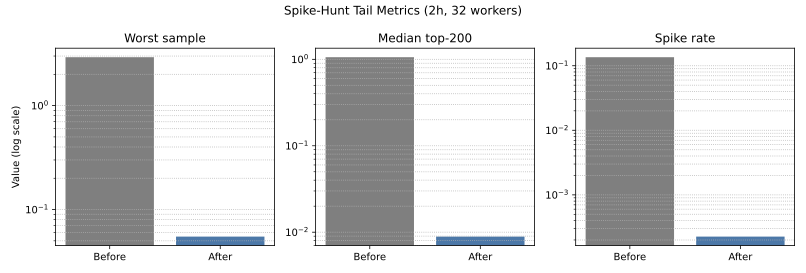

==========
Benchmarks
==========

This section investigates the performance of
:py:func:`rpack.pack`. The packing quality and time complexity are
studied by packing many randomly generated rectangles.

Packing density
===============

The *packing density* is defined as the fraction of the space filled
by the rectangles in the bounding box. The objective of
:py:func:`rpack.pack` is to obtain a packing of the greatest possible
density.

The boxplot below shows how the packing density is correlated to the
number of rectangles packed. Ten cases were generated, for 10, 20,
..., 100 rectangles.  For each case, rectangles were randomly
generated by picking side lengths uniformly distributed in the
interval [1, 1000].  If you are not familiar with boxplots, have a
look at the `boxplot`_ article at Wikipedia for an introduction.

The boxplot below shows how the packing density varies by rectangle side
lengths.

The scatter plot below shows how the minimal bounding box shape is
distributed based on how many rectangles were packed. In all runs,
random rectangles were generated by picking side lengths uniformly
distributed in the interval [1, 1000]. It is interesting to note that
the minimal bounding box tends to be more extreme (very wide or very
tall) when the number of rectangles increases.

.. figure:: _static/img/enclosing.svg
   :alt: enclosing
   :align: center

Example of 100 rectangles, high packing density:

Example of 100 rectangles, lower packing density:

Squares test
------------

The squares test packs an increasing number of square rectangles.

See this PDF, `squares.pdf`_, for packed squares 1x1, ..., NxN, for N =
1, ..., 100. A summary is shown in the plot below.

See Richard E. Korf's paper `Optimal Rectangle Packing: Initial
Results`_ for the optimal solutions for all squares up to n=22.

Circumference test
------------------

The circumference test packs an increasing number of rectangles having
the same circumference. For example, N = 4 implies the rectangles 4x1,
3x2, 2x3, and 1x4.

See this PDF, `circum.pdf`_, for packed rectangles Nx1, ..., 1xN, for
N = 1, ..., 100. A summary is shown in the plot below.

Time complexity
===============

In computer science, the time complexity is the computational
complexity that describes the amount of time it takes to run an
algorithm.

This section presents how :py:func:`rpack.pack` performs with
increasing rectangle count and size.

The figure below shows the increased computational cost when the
average rectangle side length is increased.  For each measurement point,
100 random rectangles were generated by picking independent uniformly
distributed side lengths in the interval [1, 1000]. The procedure was
repeated several times and the vertical lines indicate the standard
deviation.

The figure below shows the increased computational cost when the
number of rectangles increases.  For each measurement point, a set
of random rectangles was generated by picking independent uniformly
distributed side lengths in the interval [1, 1000]. For these 10
points, a cubic polynomial fits the data well (a quadratic does not).
However, this is not proof that the average complexity actually is
O(n^3).

Thin-Rectangle Pathology (2026-02)
==================================

A targeted benchmark campaign was run for a known edge case where one
very thin rectangle caused severe runtime spikes. The optimization was
validated against both:

* a fixed pathology input with height sweep (``h=1,2,5,...``), and
* a broad 2-hour spike-hunt workload (same configuration before/after).

Definitions used below:

* ``h``:
  the height of the first rectangle in the fixed issue sample.
  The rectangle is ``(936469, h)``; the other 9 rectangles are unchanged.
* guardrail:
  a random sanity-check baseline. In these runs:
  ``n=10`` rectangles, side lengths sampled uniformly in ``[1, 1_000_000]``.
* spike:
  a sample runtime flagged as an outlier by the spike-hunt runner using
  configured thresholds (absolute and relative). In the referenced runs:
  ``spike_threshold_seconds=0.1`` and ``relative_spike_factor=25``.

Summary (before fix vs after fix):

+-----------------------------------+----------------+----------------+
| Metric                            | Before         | After          |
+===================================+================+================+
| Pathology ``h=1`` median runtime  | ``0.4024 s``   | ``0.000486 s`` |
+-----------------------------------+----------------+----------------+
| Slowdown vs guardrail median      | ``3941x``      | ``8.84x``      |
+-----------------------------------+----------------+----------------+
| Spike-hunt worst sample           | ``2.9249 s``   | ``0.0549 s``   |
+-----------------------------------+----------------+----------------+
| Spike-hunt median of top-200 slow | ``1.0587 s``   | ``0.00889 s``  |
+-----------------------------------+----------------+----------------+
| Spike captures (2h run)           | ``183106``     | ``325``        |
+-----------------------------------+----------------+----------------+

Absolute runtimes depend on machine and load. The key signal is the
before/after ratio trends shown here.

Pathology runtime as thin-rectangle height changes:

The old implementation (blue) slows down heavily when ``h`` is small.
The fixed implementation (orange) stays in a much lower and flatter range.

Tail metrics from apples-to-apples spike-hunt runs (2h, 32 workers):

This chart summarizes tail behavior in plain numbers: worst runtime,
median of the top 200 slowest samples, and spike rate. Lower is better
for all three bars.

.. _`Optimal Rectangle Packing: Initial Results`: https://www.aaai.org/Papers/ICAPS/2003/ICAPS03-029.pdf
.. _`Optimal Rectangle Packing: An Absolute Placement Approach`: https://arxiv.org/pdf/1402.0557.pdf
.. _boxplot: https://en.wikipedia.org/wiki/Box_plot
.. _squares.pdf: _static/img/squares.pdf
.. _circum.pdf: _static/img/circum.pdf
