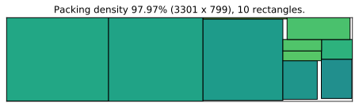
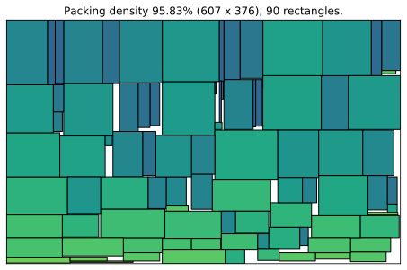
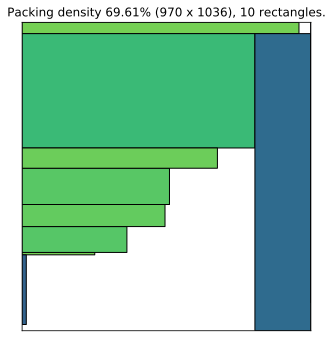
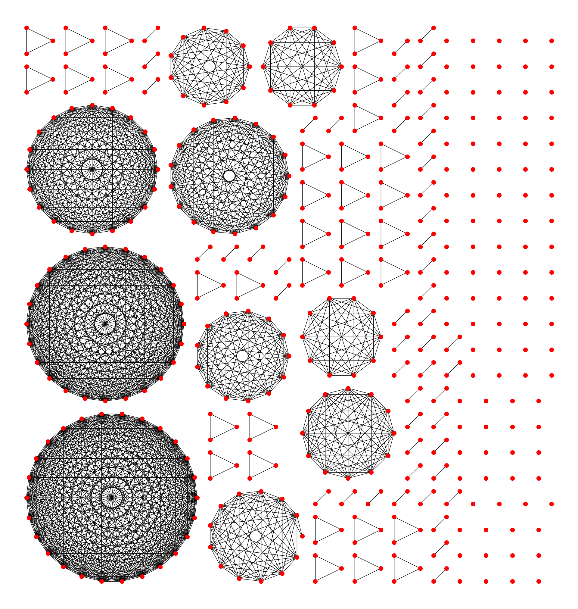

================
rectangle-packer
================

|PyPI-Versions| |PyPI-Wheel| |Build-Status| |Read-the-Docs| |GitHub-License|

|PyPI-Downloads|

.. include:: ../README.rst
   :start-after: .. docs:start:landing_intro
   :end-before: .. docs:end:landing_intro

.. include:: ../README.rst
   :start-after: .. docs:start:landing_installation
   :end-before: .. docs:end:landing_installation

.. include:: ../README.rst
   :start-after: .. docs:start:landing_usage
   :end-before: .. docs:end:landing_usage

Examples
========

**Example A:**

**Example B:**

**Example C:** Sometimes input rectangles cannot be packed very
efficiently.

**Example D:** Image contributed by Paul Brodersen for a Stack Overflow
discussion at stackoverflow_.

.. _Read the Docs: https://rectangle-packer.readthedocs.io/en/latest/
.. _GitHub: https://github.com/Penlect/rectangle-packer
.. _`Fast Optimizing Rectangle Packing Algorithm for Building CSS Sprites`: http://www.codeproject.com/Articles/210979/Fast-optimizing-rectangle-packing-algorithm-for-bu
.. _`clone the repository`: https://github.com/Penlect/rectangle-packer
.. _stackoverflow: https://stackoverflow.com/a/53156709/2912349
.. _PyPI: https://pypi.org/project/rectangle-packer/
..  _`divide-and-conquer algorithm`: https://en.wikipedia.org/wiki/Divide-and-conquer_algorithm

.. toctree::
   :maxdepth: 2
   :caption: Documentation

   rpack
   algorithm
   benchmarks
   changelog

.. |PyPI-Versions| image:: https://img.shields.io/pypi/pyversions/rectangle-packer.svg
   :target: https://pypi.org/project/rectangle-packer

.. |PyPI-Wheel| image:: https://img.shields.io/pypi/wheel/rectangle-packer.svg
   :target: https://pypi.org/project/rectangle-packer

.. |Build-Status| image:: https://github.com/Penlect/rectangle-packer/actions/workflows/build_wheels.yml/badge.svg?branch=master
   :target: https://github.com/Penlect/rectangle-packer/actions/workflows/build_wheels.yml

.. |Read-the-Docs| image:: https://img.shields.io/readthedocs/rectangle-packer.svg
   :target: https://rectangle-packer.readthedocs.io/en/latest

.. |GitHub-License| image:: https://img.shields.io/github/license/Penlect/rectangle-packer.svg
   :target: https://raw.githubusercontent.com/Penlect/rectangle-packer/travis/LICENSE.md

.. |PyPI-Downloads| image:: https://img.shields.io/pypi/dm/rectangle-packer.svg
   :target: https://pypi.org/project/rectangle-packer
